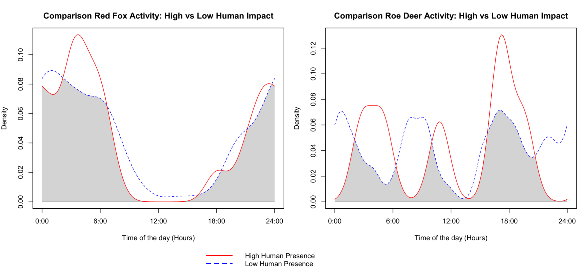

<div align="center">

# Temporal Activity Patterns of Red Fox and Roe Deer Under Human Disturbance

**Lara Nigelli**  
Spatial Ecology in R  
February 2026

</div>

<div align="justify">

# Introduction
The rapid expansion of urban and peri-urban areas has forced wildlife to adapt to fragmented landscapes and high levels of anthropogenic pressure. Temporal activity is a fundamental dimension of an animal's niche, governing foraging, mating, and survival. Significant shifts in natural rhythms can lead to increased stress, reduced reproductive success, or altered predator-prey dynamics. 
Human presence often acts as a disturbance, pushing wildlife towards nocturnal behaviors to avoid contact. Not all species respond equally to human disturbance; some are urban adapters, capable of persisting in modified landscapes, whereas others respond by temporally avoiding periods of high human activity.

## Study objective
- to quantify temporal overlap between high and low human impact sites.
- to evaluate whether species modify their activity patterns under different levels of disturbance.
  
# Materials and Methods

## Study Area and Dataset

The dataset used in this study was obtained from a camera-trap monitoring program conducted in a human-modified landscape. The data consist of wildlife detections recorded across multiple sampling urban sites around Florence, including both natural and anthropogenic areas. Here you can find the [complete dataset](https://data.mendeley.com/datasets/3htr438mcw/1). 

Each record includes information on species identity, site location, and time of detection. For the present analysis, only records with valid time information were retained.

Human detections were used as a proxy for anthropogenic disturbance. Sites were classified as high-impact when the number of human detections exceeded 25 records, and low-impact otherwise.

Two species were selected for analysis: Red Fox (_Vulpes vulpes_) and Roe Deer (_Capreolus capreolus_), representing species with different ecological and behavioral traits.

## Packages used in R

The packages needed are the following:

```r
library(overlap)
library(lubridate)
```
  
`overlap` provides functions to fit kernel density functions to data on temporal activity patterns of animals and estimate coefficients of overlapping of densities for two species. This package is useful for circular statistics, when treating data as circular. The package allows us to calculate delta estimators to quantify the similarity between two curves.
  
`lubridate` provides functions to work with date-times and time-spans. It is applied for data standardization and time arithmetic allowing to extract time and isolate specific time of day from the date. It allows conversion of time into decimal hours, which is required before transforming data into radians.

# Data processing 

The dataset was placed in the working directory before running the script. The dataset can be uploaded in R by: 
```r
mydata <- read.csv("UrbanDataset_Read-Only.csv", sep = ";")
```

## Time conversion

In order to convert time in radians, I firstly transformed it into a fraction of the day (from 0 to 1) and eventually removed the lines where the hour values are missing. 
```r
mydata$circtime <- as.numeric(hms(mydata$Hour)) / 86400 * 2 * pi
mydata <- mydata[!is.na(mydata$circtime), ] 
```

## Definition of High and Low Human Impact

For each site, the number of human detections was calculated. Sites with more than 25 human observations were classified as High impact sites.
```r
human_counts <- table(mydata$Site[mydata$Sps == "Human"])
high_human_sites <- names(human_counts[human_counts > 25])
mydata$Impact <- ifelse(mydata$Site %in% high_human_sites, "High", "Low")
```

## Species filters 
From the main dataset I extract by filtering the species I am interested in, the red fox ($n = 502$) and the roe deer ($n = 151$). 
```r
fox <- mydata[mydata$Sps == "RedFox", ]
roedeer <- mydata[mydata$Sps == "RoeDeer", ]
```
Fox and roe deer are divided into two groups, according if the observation was made in a High Site or a Low Site. 
```r
fox_high <- fox[fox$Impact == "High", ]
fox_low <- fox[fox$Impact == "Low", ]
roedeer_high <- roedeer[roedeer$Impact == "High", ]
roedeer_low <- roedeer[roedeer$Impact == "Low", ]
```

To extract only the time vectors: 
```r
fox_high_time <- fox_high$circtime
fox_low_time <- fox_low$circtime
roedeer_high_time <- roedeer_high$circtime
roedeer_low_time <- roedeer_low$circtime
```

# Statistical Analysis
## Kernel Density
It is based on a non-parametric method to estimate the probability density function of a random variable, creating a smooth, continuous probability curve from data points, providing a more realistic biological model. The density plots for high and low impact sites are produced both for the red fox and for the roe deer. 
```r
densityPlot(fox_high_time, main = "Red Fox activity - High Human Presence")
densityPlot(roedeer_high_time, main = "Roe Deer activity - High Human Presence")
densityPlot(fox_low_time, main = "Red Fox Activity - Low Human Presence")
densityPlot(roedeer_low_time, main = "Roe Deer Activity - Low Human Presence")
```
In order to obtain a numeric estimate of the overlap:
```r
overlap_fox_index <- overlapEst(fox_high_time, fox_low_time, type = "Dhat4")
overlap_roedeer_index <- overlapEst(roedeer_high_time, roedeer_low_time, type = "Dhat4")
```
The coefficient of overlap (Δ) measures the area of intersection between two kernel density curves, providing an estimate of temporal similarity between activity patterns. The estimator `Dhat4` was chosen as recommended for sample sizes larger than 50 observations.

Finally, activity patterns between high and low impact sites were visually compared using overlap plots.
```r
overlapPlot(fox_high_time, fox_low_time, 
            main = "Comparison Red Fox Activity: High vs Low Human Impact",
            xlab = "Time of the day (Hours)",
            linecol = c("red", "blue"),
            olapcol = "lightgrey", 
            xscale = 24) 

overlapPlot(roedeer_high_time, roedeer_low_time, 
            main = "Comparison Roe Deer Activity: High vs Low Human Impact",
            xlab = "Time of the day (Hours)",
            linecol = c("red", "blue"),
            olapcol = "lightgrey",
            xscale = 24)
```

# Results 

## Overlap Coefficients (Δ) and patterns description

The coefficient of temporal overlap ranges from 0 (no overlap) to 1 (complete overlap, identical activity patterns).

The Red Fox showed a high overlap between high and low human impact sites (Δ = 0.85). The density curves are largely synchronized, displaying a predominantly nocturnal and crepuscular pattern with peak activity between 21:00 and 05:00. This indicates minimal temporal adjustment across disturbance levels.

Roe Deer exhibited a moderate overlap (Δ = 0.51), suggesting partial temporal differentiation between high and low impact sites. Although the general crepuscular pattern is maintained, differences in the shape and intensity of the curves indicate a moderate behavioral adjustment under increased human disturbance.



# Discussion

## Biological Interpretation and Species Comparison

The results highlight species-specific responses to human disturbance in the study area.

The high overlap observed for the Red Fox (Δ = 0.85) suggests strong temporal stability across disturbance levels. As a predominantly nocturnal and crepuscular species, the Red Fox may already avoid periods of intense human activity, reducing the need for additional behavioral shifts in high-impact sites. This intrinsic temporal segregation likely contributes to its success as an urban adapter.

In contrast, Roe Deer displayed a moderate overlap (Δ = 0.51), indicating a greater degree of temporal adjustment in response to human disturbance. While the general activity pattern remains crepuscular, variations in activity distribution suggest behavioral plasticity. Compared to the Red Fox, Roe Deer appear more sensitive to changes in disturbance intensity, potentially reflecting differences in ecological strategy, risk perception, or habitat use.

Overall, these findings suggest that temporal responses to anthropogenic pressure are species-specific and may depend on pre-existing activity rhythms and ecological flexibility.

### Supplementary Materials
For a detailed view of the individual activity patterns, you can access the full-size PDF plots here:

* [Red Fox Activity - High Impact](redfoxactivity_high.pdf)
* [Red Fox Activity - Low Impact](redfoxactivity_low.pdf)
* [Roe Deer Activity - High Impact](roedeeractivity_high.pdf)
* [Roe Deer Activity - Low Impact](roedeeractivity_low.pdf)

To check for the plot regarding human activity, you can access the full-size PDF plot here:

* [Human Activity](humanactivityvalidation.pdf)

</div>


